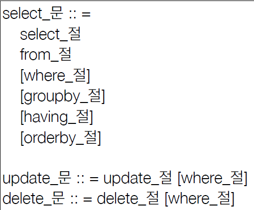

# JPQL 문법

- select m from Member as m where m.age > 18
- 엔티티와 속성은 대소문자 구분 O (Member, age)
- JPQL 키워드는 대소문자 구분 X (SELECT, FROM, where)
- 엔티티 이름 사용, 테이블 이름 아님(Member)
- 별칭 필수(m) (as 생략 가능)

### TypeQuery
````java
TypedQuery<Member> query = em.createQuery("SELECT m FROM Member m", Member.class);
````
- 반환 타입이 명확할 때

### Query 
````java
Query query = em.createQuery("SELECT m.username, m.age FROM Member m");
````
- 반환 타입이 명확하지 않을 때

### 결과 조회 API
- query.getResultList(): 결과가 하나 이상일 때, 리스트 반환
  - 결과 없으면 빈 리스트 반환
- query.getSingleResult(): 결과가 정확히 하나, 단일 객체 반환
  - 결과 없으면: javax.persistence.NoResultException
  - 둘 이상이면: javax.persistence.NonUniqueResultException

### 파라미터 바인딩
- 이름 기준
````java
SELECT m FROM Member m where m.username=:username
query.setParameter("username", usernameParam);
````
- 위치 기준: 장애 발생 가능성 높음
````java
SELECT m FROM Member m where m.username=?1
query.setParameter(1, usernameParam);
````

# 프로젝션
- SELECT 절에 조회할 대상을 지정하는 것
- 프로젝션 대상: 엔티티, 임베디드 타입, 스칼라 타입(숫자, 문자 등 기본 데이터 타입)
- SELECT m FROM Member m -> 엔티티 프로젝션
- SELECT m.team FROM Member m -> 엔티티 프로젝션
- SELECT m.address FROM Member m -> 임베디드 타입 프로젝션
- SELECT m.username, m.age FROM Member m -> 스칼라 타입 프로젝션
- DISTINCT로 중복 제거

### 여러 값 조회
- SELECT m.username, m.age FROM Member m
  1. Query 타입으로 조회
  2. Object[] 타입으로 조회
  3. new 명령어로 조회
     - 단순 값을 DTO로 바로 조회
     - SELECT new jpabook.jpql.UserDTO(m.username, m.age) FROM Member m
     - 패키지 명을 포함한 전체 클래스명 입력
     - 순서와 타입 일치하는 생성자 필요   
     
MemberDTO.java
````java
public class MemberDTO {
    private String username;
    private int age;

    public MemberDTO(String username, int age) {
        this.username = username;
        this.age = age;
    }
    
    public String getUsername() { return username; }
    public void setUsername(String username) { this.username = username; }
    public int getAge() { return age; }
    public void setAge(int age) { this.age = age; }
}
````
main.java
````java
Member member = new Member();
member.setUsername("Song");
member.setAge(10);
em.persist(member);

em.flush();
em.clear();

List<MemberDTO> resultList = em.createQuery("SELECT new jpql.MemberDTO(m.username, m.age) FROM Member m", MemberDTO.class).getResultList();

MemberDTO memberDTO = resultList.get(0);
System.out.println(memberDTO.getUsername());
System.out.println(memberDTO.getAge());

tx.commit();
````

# 페이징
- setFirstResult(int startPosition) : 조회 시작 위치
  (0부터 시작)
- setMaxResults(int maxResult) : 조회할 데이터 수

# 20211004_JOIN
- 내부 조인:
  - SELECT m FROM Member m [INNER] JOIN m.team t
- 외부 조인:
  - SELECT m FROM Member m LEFT [OUTER] JOIN m.team t
- 세타 조인:
  - SELECT COUNT(m) FROM Member m, Team t WHERE m.username = t.name

### ON절을 활용한 조인(JPA 2.1 ~)
1. 조인 대상 필터링
   - ex) 회원과 팀을 조인하면서, 팀 이름이 A인 팀만 조인
   - JPQL: SELECT m, t FROM Member m LEFT JOIN Team m.team t ON t.name = 'A'
   - SQL: SELECT m.*, t.* FROM Member m LEFT JOIN Team t ON m.Team_ID = t.id AND t.name = 'A'
2. 연관관계 없는 엔티티 외부 조인(하이버네이트 5.1 ~)
   - ex) 회원의 이름과 팀의 이름이 같은 대상 외부 조인
   - JPQL: SELECT m, t FROM Member m LEFT JOIN Team t ON m.username = t.name
   - SQL: SELECT m.*, t.* FROM Member m LEFT JOIN Team t ON m.username = t.name

# 서브 쿼리
- 나이가 평균보다 많은 회원
  - SELECT m FROM Member m WHERE m.age > (SELECT AVG(m2.age) FROM Member m2)
- 한 건이라도 주문한 고객
  - SELECT m FROM Member m WHERE (SELECT COUNT(o) FROM Order o WHERE m = o.member) > 0

### 서브 쿼리 지원 함수
- [NOT] EXISTS (sub query): 서브 쿼리에 결과가 존재하면 참
- ex) 팀A 소속인 회원
- SELECT m FROM Member m WHERE EXISTS (SELECT t FROM m.team t WHERE t.name = '팀A')
  - {ALL|ANY|SOME} (sub query)
  - ALL 모두 만족하면 참
    - ex) 전체 상품 각각의 재고 보다 주문량이 많은 주문들
    - SELECT o FROM Order o WHERE o.orderAmount > ALL (SELECT  p.stockAmout From Product p)
  - ANY, SOME: 같은 의미, 조건을 하나라도 만족하면 참
    - ex) 어떤 팀이든 팀에 소속된 회원
    - SELECT m FROM Member m WHERE m.team = ANY (SELECT t FROM Team t)
- [NOT] IN (sub query): 서브쿼리의 결과 중 하나라도 같은 것이 있으면 참

### JPA 서브 쿼리의 한계
- WHERE, HAVING 절에서만 서브 쿼리 사용 가능
- SELECT절도 가능(하이버네이트 지원)
- FROM절의 서브 쿼리는 현재 JPQL에서 불가능
  - JOIN으로 풀 수 있으면 풀어서 해결