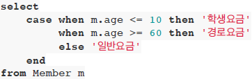
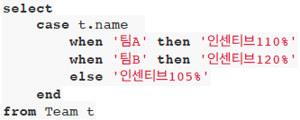
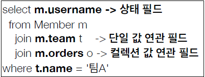

# JPQL 문법

- select m from Member as m where m.age > 18
- 엔티티와 속성은 대소문자 구분 O (Member, age)
- JPQL 키워드는 대소문자 구분 X (SELECT, FROM, where)
- 엔티티 이름 사용, 테이블 이름 아님(Member)
- 별칭 필수(m) (as 생략 가능)

### TypeQuery
````java
TypedQuery<Member> query = em.createQuery("SELECT m FROM Member m", Member.class);
````
- 반환 타입이 명확할 때

### Query 
````java
Query query = em.createQuery("SELECT m.username, m.age FROM Member m");
````
- 반환 타입이 명확하지 않을 때

### 결과 조회 API
- query.getResultList(): 결과가 하나 이상일 때, 리스트 반환
  - 결과 없으면 빈 리스트 반환
- query.getSingleResult(): 결과가 정확히 하나, 단일 객체 반환
  - 결과 없으면: javax.persistence.NoResultException
  - 둘 이상이면: javax.persistence.NonUniqueResultException

### 파라미터 바인딩
- 이름 기준
````java
SELECT m FROM Member m where m.username=:username
query.setParameter("username", usernameParam);
````
- 위치 기준: 장애 발생 가능성 높음
````java
SELECT m FROM Member m where m.username=?1
query.setParameter(1, usernameParam);
````

# 프로젝션
- SELECT 절에 조회할 대상을 지정하는 것
- 프로젝션 대상: 엔티티, 임베디드 타입, 스칼라 타입(숫자, 문자 등 기본 데이터 타입)
- SELECT m FROM Member m -> 엔티티 프로젝션
- SELECT m.team FROM Member m -> 엔티티 프로젝션
- SELECT m.address FROM Member m -> 임베디드 타입 프로젝션
- SELECT m.username, m.age FROM Member m -> 스칼라 타입 프로젝션
- DISTINCT로 중복 제거

### 여러 값 조회
- SELECT m.username, m.age FROM Member m
  1. Query 타입으로 조회
  2. Object[] 타입으로 조회
  3. new 명령어로 조회
     - 단순 값을 DTO로 바로 조회
     - SELECT new jpabook.jpql.UserDTO(m.username, m.age) FROM Member m
     - 패키지 명을 포함한 전체 클래스명 입력
     - 순서와 타입 일치하는 생성자 필요   
     
MemberDTO.java
````java
public class MemberDTO {
    private String username;
    private int age;

    public MemberDTO(String username, int age) {
        this.username = username;
        this.age = age;
    }
    
    public String getUsername() { return username; }
    public void setUsername(String username) { this.username = username; }
    public int getAge() { return age; }
    public void setAge(int age) { this.age = age; }
}
````
main.java
````java
Member member = new Member();
member.setUsername("Song");
member.setAge(10);
em.persist(member);

em.flush();
em.clear();

List<MemberDTO> resultList = em.createQuery("SELECT new jpql.MemberDTO(m.username, m.age) FROM Member m", MemberDTO.class).getResultList();

MemberDTO memberDTO = resultList.get(0);
System.out.println(memberDTO.getUsername());
System.out.println(memberDTO.getAge());

tx.commit();
````

# 페이징
- setFirstResult(int startPosition) : 조회 시작 위치
  (0부터 시작)
- setMaxResults(int maxResult) : 조회할 데이터 수

# 20211004_JOIN
- 내부 조인:
  - SELECT m FROM Member m [INNER] JOIN m.team t
- 외부 조인:
  - SELECT m FROM Member m LEFT [OUTER] JOIN m.team t
- 세타 조인:
  - SELECT COUNT(m) FROM Member m, Team t WHERE m.username = t.name

### ON절을 활용한 조인(JPA 2.1 ~)
1. 조인 대상 필터링
   - ex) 회원과 팀을 조인하면서, 팀 이름이 A인 팀만 조인
   - JPQL: SELECT m, t FROM Member m LEFT JOIN Team m.team t ON t.name = 'A'
   - SQL: SELECT m.*, t.* FROM Member m LEFT JOIN Team t ON m.Team_ID = t.id AND t.name = 'A'
2. 연관관계 없는 엔티티 외부 조인(하이버네이트 5.1 ~)
   - ex) 회원의 이름과 팀의 이름이 같은 대상 외부 조인
   - JPQL: SELECT m, t FROM Member m LEFT JOIN Team t ON m.username = t.name
   - SQL: SELECT m.*, t.* FROM Member m LEFT JOIN Team t ON m.username = t.name

# 서브 쿼리
- 나이가 평균보다 많은 회원
  - SELECT m FROM Member m WHERE m.age > (SELECT AVG(m2.age) FROM Member m2)
- 한 건이라도 주문한 고객
  - SELECT m FROM Member m WHERE (SELECT COUNT(o) FROM Order o WHERE m = o.member) > 0

### 서브 쿼리 지원 함수
- [NOT] EXISTS (sub query): 서브 쿼리에 결과가 존재하면 참
- ex) 팀A 소속인 회원
- SELECT m FROM Member m WHERE EXISTS (SELECT t FROM m.team t WHERE t.name = '팀A')
  - {ALL|ANY|SOME} (sub query)
  - ALL 모두 만족하면 참
    - ex) 전체 상품 각각의 재고 보다 주문량이 많은 주문들
    - SELECT o FROM Order o WHERE o.orderAmount > ALL (SELECT  p.stockAmout From Product p)
  - ANY, SOME: 같은 의미, 조건을 하나라도 만족하면 참
    - ex) 어떤 팀이든 팀에 소속된 회원
    - SELECT m FROM Member m WHERE m.team = ANY (SELECT t FROM Team t)
- [NOT] IN (sub query): 서브쿼리의 결과 중 하나라도 같은 것이 있으면 참

### JPA 서브 쿼리의 한계
- WHERE, HAVING 절에서만 서브 쿼리 사용 가능
- SELECT절도 가능(하이버네이트 지원)
- FROM절의 서브 쿼리는 현재 JPQL에서 불가능
  - JOIN으로 풀 수 있으면 풀어서 해결

# JPQL 타입 표현
- 문자: 'HELLO', 'She''s'
- 숫자: 10L(Long), 10D(Double), 10F(Float)
- Boolean: TRUE, FALSE
- ENUM: jpabook.MemberType.Admin(패키지명 포함)
- 엔티티 타입: TYPE(m) = Member (상속 관계에서 사용)

### JPQL 기타
- SQL 과 문법이 같은 식
  - EXISTS, IN
  - AND, OR, NOT
  - =, >, >=, <, <=, <>
  - BETWEEN, LIKE, IS [NOT] NULL

# 조건식
### CASE식
- 기본 CASE식   
   
````java
String query = "SELECT " +
        "CASE WHEN m.age <= 10 THEN '학생요금'" +
        "     WHEN m.age >= 60 THEN '경로요금'" +
        "     ELSE '일반요금'" +
        "     END " +
        "     FROM Member m";

List<String> resultList = em.createQuery(query, String.class).getResultList();
````
- 단순 CASE식   
  
- COALESCE: 하나씩 조회해서 NULL 아니면 반환
  - ex) 사용자 이름 없으면 이름 없는 회원 반환
  - SELECT COALESCE(m.username, '이름 없는 회원') FROM Member m
- NULLIF: 두 값이 같으면 NULL 반환, 다르면 첫 번째 값 반환
  - ex) 사용자 이름이 '관리자'면 NULL 반환하고 나머지는 본인 이름 반환
  - SELECT NULLIF(m.username, '관리자') FROM Member m

# JPQL 함수
### JPQL 기본 함수
- CONCAT
- SUBSTRING
- TRIM
- LOWER, UPPER
- LENGTH
- LOCATE
- ABS, SQRT, MOD
- SIZE, INDEX(JPA 용도)

### 사용자 정의 함수 호출
- 하이버네이트는 사용 전 방언에 추가해야 함
  - 사용하는 DB 방언 상속받고, 사용자 정의 함수를 등록
  ````java
  public class MyH2Dialect extends H2Dialect {
    public MyH2Dialect() {
        registerFunction("group_concat", new StandardSQLFunction("group_concat", StandardBasicTypes.STRING));
    }
  }
  ````
  - persistence.xml
  ````
  <property name="hibernate.dialect" value="dialect.MyH2Dialect"/>
  ````
  - main.java
  ````java
  //String query = "SELECT FUNCTION('group_concat', m.username) FROM Member m";
  String query = "SELECT group_concat(m.username) FROM Member m";
  List<String> resultList = em.createQuery(query, String.class).getResultList();
  for(String s : resultList) { System.out.println(s); }
  tx.commit();
  ````
  
# 20211005_경로 표현식
- .(점)을 찍어 객체 그래프를 탐색하는 것

- 상태 필드(state field): 단순히 값을 저장하기 위한 필드
- 단일 값 연관 필드(association field): 연관관계를 위한 필드
  - 단일값 연관 필드: @ManyToOne, @OneToOne, 대상이 엔티티(ex: m.team)
  - 컬렉션 값 연관 필드: @OneToMany, @ManyToMany, 대상이 컬렉션(ex: m.orders)
- 컬렉션 값 연관 필드

### 경로 표현식 특징
- 상태 필드(state field): 경로 탐색의 끝, 탐색 X
- 단일값 연관 경로: 묵시적 내부 조인(inner join) 발생, 탐색 O
- 컬렉션 값 연관 경로: 묵시적 내부 조인 발생, 탐색 X
  - FROM절에서 명시적 조인을 통해 별칭을 얻으면 별칭을 통해 탐색 가능
- 실무에서 묵시적 조인은 사용하지 않는 것이 좋다..

### 명시적 조인
- JOIN 키워드 직접 사용
  - SELECT m FROM Member m JOIN m.team t

### 묵시적 조인
- 경로 표현식에 의해 묵시적으로 SQL 조인 발생(내부 조인만 가능)
  - SELECT m.team FROM Member m

### 경로 탐색을 사용한 묵시적 조인 시 주의사항
- 항상 내부 조인
- 컬렉션은 경로 탐색의 끝, 명시적 조인을 통해 별칭을 얻어야 함
- 경로 탐색은 주로 SELECT, WHERE 절에서 사용하지만 묵시적 조인으로 인해 SQL의 FROM (JOIN) 절에 영향을 줌
- 가급적 묵시적 조인 대신 명시적 조인 사용
- 조인은 SQL 튜닝에 중요 포인트
- 묵시적 조인은 조인이 일어나는 상황을 한눈에 파악하기 어려움

# fetch join
- SQL조인 종류 X
- JPQL에서 성능 최적화를 위해 제공하는 기능
- 연관된 엔티티나 컬렉션을 SQL 한 번에 함께 조회하는 기능
- JOIN FETCH 명령어 사용
- 페치 조인 ::= [ LEFT [OUTER]|INNER ] JOIN FETCH 조인 경로

### 엔티티 페치 조인
- 회원을 조회하면서 연관된 팀 함께 조회(SQL 한 번에)
- JPQL: SELECT m FROM Member m JOIN FETCH m.team
- SQL: SELECT M.*, T.* FROM MEMBER M INNER JOIN TEAM T ON M.TEAM_ID=T.ID

### 컬렉션 페치 조인
- 일대다 관계, 컬렉션 페치 조인
- JPQL: SELECT t
        FROM Team t JOIN FETCH t.members
        WHERE t.name = '팀A'
- SQL: SELECT T.*, M.*
       FROM TEAM T
       INNER JOIN MEMBER M ON T.ID = M.TEAM_ID
       WHERE T.NAME = '팀A'
- DISTINCT
  - SQL의 DISTINCT는 중복 결과를 제거하는 명령
  - JPQL의 DISTINCT는
    1. SQL에 DISTINCT 추가
    2. 애플리케이션에서 엔티티 중복 제거
    - SELECT DISTINCT t FROM Team t JOIN FETCH t.members
      - SQL에 DISTINCT 추가하지만 데이터가 다르므로 SQL 결과에서 중복 제거 실패
      - DISTINCT가 추가로 애플리케이션에서 중복 제거 시도
      - 같은 식별자를 가진 Team 엔티티 제거 

### 페치 조인 vs 일반 조인
- 일반 조인 실행 시 연관 엔티티 함께 조회 X
  - JPQL : SELECT t
           FROM Team t 
           JOIN t.members m
           WHERE t.name = '팀A'
  - SQL : SELECT T.*
          FROM TEAM T
          INNER JOIN MEMBER M ON T.ID = M.TEAM_ID
          WHERE T.NAME = '팀A'
  - JPQL은 결과 반환 시 연관관계 고려 X
    - 단지 SELECT 절에 지정한 엔티티 조회할 뿐
    - 여기서는 Team 엔티티만 조회하고, 회원 엔티티 조회 X
  - 페치 조인을 사용할 때만 연관된 엔티티도 함께 조회(즉시 로딩)
  - 페치 조인은 객체 그래프를 SQL 한 번에 조회하는 개념
    - JPQL : SELECT t
             FROM Team t
             JOIN FETCH t.members 
             WHERE t.name = '팀A'
    - SQL : SELECT T.*, M.*
            FROM TEAM T
            INNER JOIN MEMBER M ON T.ID = M.TEAM_ID
            WHERE T.NAME = '팀A'

### 페치 조인의 특징과 한계
- 페치 조인 대상에는 별칭 줄 수 없음
  - 하이버네이트는 가능하나 가급적 사용 X
- 둘 이상의 컬렉션은 페치 조인 불가
- 컬렉션을 페치 조인하면 페이징 API(setFirstResult, setMaxResults) 사용 불가
  - 일대일, 다대일 같은 단일 값 연관 필드들은 페치 조인해도 페이징 가능
  - 하이버네이트는 경고 로그를 남기고 메모리에서 페이징(위험)
    - WARN: HHH000104: firstResult/maxResults specified with collection fetch; applying in memory!
- 연관된 엔티티들을 SQL 한 번으로 조회 - 성능 최적화
- 엔티티에 직접 적용하는 글로벌 로딩 전략 보다 우선함
  - @OneToMany(fetch = FetchType.LAZY)
- 실무에서 글로벌 로딩 전략은 모두 지연 로딩
- 최적화가 필요한 곳은 페치 조인 적용
- 모든 것을 페치 조인으로 해결할 수는 없음
- 페치 조인은 객체 그래프를 유지할 때 사용하면 효과적
- 여러 테이블을 조인해서 엔티티가 가진 모양이 아닌 전혀 다른 결과를 내야 하면, 페치 조인 보다는 일반 조인을 사용하고 필요한 데이터들만 조회하여 DTO로 반환하는 것이 효과적
- 

### @BatchSize
````
<property name="hibernate.default_batch_fetch_size" value="100" />
````
or
````java
    //@BatchSize(size = 100) // Team 가져올 때 한꺼번에 보낼 수 있는 Team 개수
    @OneToMany(mappedBy = "team")
    private List<Member> members = new ArrayList<>();
````